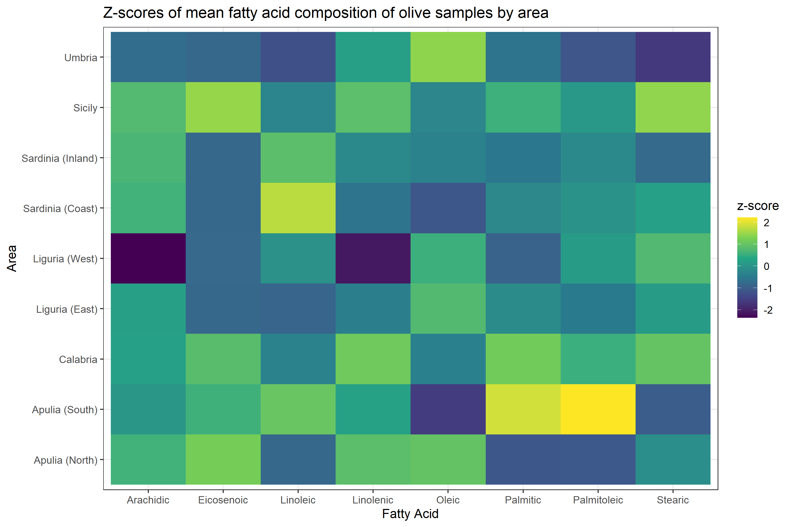

# Clustering of Italian Olive Oils with their Fatty Acid Composition
## Use of K-Means, Gaussian Mixture Models and HDBSCAN

## Objectives

The objective of this repo was to compare the use various clustering techniques on data of the fatty acid composition of various Italian Olive oils. 

The clustering techniques used were:
- K-Means
- Gaussian Mixture Models (GMM)
- HDBSCAN

***
## Report

The output from this analysis can be read on this article in [RPubs](https://rpubs.com/jeandsantos88/928554).

***

## Data

The data used is from a paper by Forina, Armanino, Lanteri, Tiscornia (1983) [*Classification of Olive Oils from their Fatty Acid Composition*](https://www.researchgate.net/publication/239459050_Classification_of_olive_oils_from_their_fatty_acid_composition), in Martens and Russwurm (ed) Food Research and Data Anlysis. I thank Prof. Michele Forina, University of Genova, Italy for making this dataset available.

***
## Reproducing the environment

You can reproduce the environment by using the [`renv`](https://rstudio.github.io/renv/) package and the `renv.lock` file available in this repo.

***

## Questions and Feedback

For questions or feedback please contact me via [LinkedIn](https://www.linkedin.com/in/jeandsantos/) or [email](mailto:jeandsantos88@gmail.com?subject=StrengthFinder%3A%20Questions%20and%20Requests).

For code fixes feel free to raise an issue.